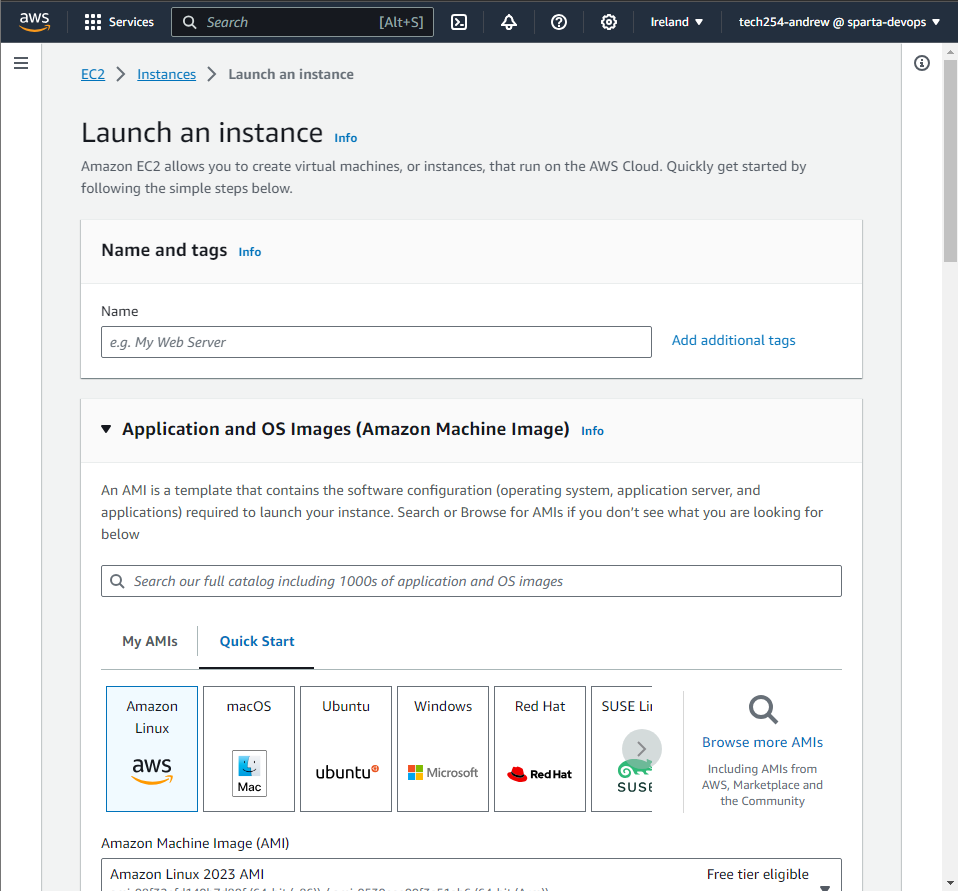

# AWS

## VM

1. Click into EC2

2.  Go into Instances.

3. To Launch, press Launch Instance Button.

4. Now name the instance.
   1. Need universally unique name.
   2. Use following naming convention:
   3. tech254_andrew_testvm

5. 