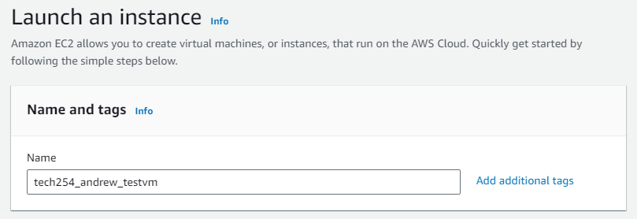

# AWS EC2

## VM Set Up

1. Click into EC2

2.  Go into Instances.

3. To Launch, press Launch Instance Button.

4. Now name the instance.
   1. Need universally unique name.
   2. Use following naming convention:
   3. tech254_andrew_testvm

5. Image selection
   1. Similar to picking a template
   2. What is the starting point?

6. Amazon Machine Image (AMI)

7. Instance Type

8. Key Pair:

9. Network Settings:
   1. Edit.
   2. change security group name.

10. Storage:
    1. For now, leave as default.

11. Advanced Details:
    1. For now, leave as blank.

12. Summary:
    1. Can change number of instances to launch. Leave as 1.

