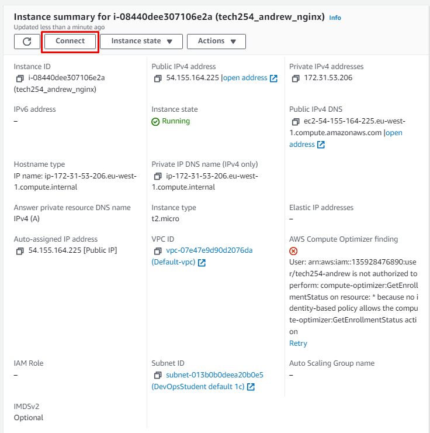
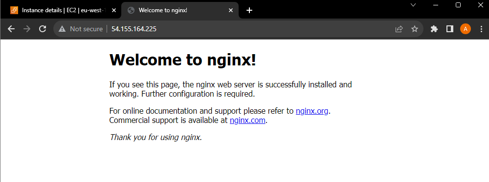

# NGINX Setup Through EC2

### Prerequisites

Ensure you are connected to the correct region. In this instance, we will be using `eu-west-2`, "Ireland", marked in red:

## Setting up EC2

1. Navigate to the Console Home on the Amazon web services page.
   1. This can searched in the Search Bar or from recently visited:

2. Select the Launch Instance Button:

3. Create a viable name.
    1. Note: this name must be globally unique.
    2. Follow the provided naming convention.

4. Select the required AMI.
   1. In this example, we will be browsing for alternative AMIs.
   2. Then using the Community AMI's.
   3. Following this, we then search for 18.04 LTS 1e9. This is enough input to filter down to the AMI we are searching for.

5. Select Instance type.
   1. For our purposes, we do not need much computational power, and so we will use the `t2.micro`

6. Enter your given key pair.
   1. Later, you will need access to a .pem file that acts as the private side of this key.
   2. In this instance, we are using the rsa key tech254.

7. Network settings:
   1. Leave all settings as default until you reach Security group name.
   2. Choose a unique and descriptive name here.
   3. Security group lets us assign rules to a group we will make.

### Ports

- The URL is a pointer to where you want to go.
- URL acts as a human readable IP address.
- An IP address is like a house number.

Some standard ports:

- http = port 80
- https = port 8080
- ssh = port 22
- node = port 3000 (usually)

8. Add in the following Security Group Rules:
   1. `HTTP` - Leave everything as default with the exception of the source, changing it to 0.0.0.0/0 for global reach.
   2. `HTTPS` - Leave everything as default with the exception of the source, changing it to 0.0.0.0/0 for global reach.

9. Storage Configuration:
   1.  Leave as default.

10. Summary:
    1.  Check over summary to ensure all options selected match with requirements.
    2.  Press the marked Launch Instance button.

## Connecting to EC2

1. Use the newly generated link to go to your EC2 page:

2. Click on the Connect button:

3. Navigate to the SSH client tab:

4. Locate your previously hidden .pem private key, possibly located within your hidden .ssh folder.
   1. See terminal input:
   2. Make sure the key is readable:

5. Use the provided command to connect to your ubuntu user profile on the EC2.
   1. For our use, the command is:
   2. `ssh -i "tech254.pem" ubuntu@ec2-54-155-164-225.eu-west-1.compute.amazonaws.com`
   3. `-i` identity by using:
   4. `tech254.pem` is the identity
   5. `ubunutu` this is the user we are logging in as on the server.
   6. `@ec2-54-155-164-225.eu-west-1.compute.amazonaws.com` is where we want to go.

6. In the terminal, say `yes` to approve the authenticity.

7. Note the change in the terminal output and name.
   1. You are now logged in to your EC2.

8. Make sure your machine is up to date.
   1. `sudo apt update`
   2. The above command searches and files the available updates for your machine, but does not install and deploy them.
   3. `sudo apt upgrade -y`
   4. The above command deploys the changes from the previously cached downloads.
   5. The `-y` flag agrees to all changes automatically.
   6. Do this step before launching important applications, as later updates and upgrades may cause issues.

## Setting Up NGINX

1. Install NGINX on your EC2 using the following:
   1. `sudo apt install nginx -y`

2.  To verify the application has installed, start it, and then check its status:
    1.  `sudo systemctl start nginx`
    2.  `sudo systemctl status nginx`
    3.  press `q` to leave the status.

3. NGINX is now running.
4. Navigate back to your EC2 instance page.
   1. Find the Public IPv4 address.
   2. Copy the address.
   3. Paste this into your browser URL bar.

## Getting files onto the VM instance:

The first five steps are optional, and are in place for those who have not yet set up / connected to a repository.

1. Set up a new folder. 
   1. Make sure to have all of your necessary files and code within this folder.
   2. Make sure the terminal being used in this folder is a using bash shell:

2. Initialise this folder as a git repository.

3. Set up a new repository for your folders and code.
   1. Copy the remote origin, and paste the command into your bash terminal.

4. Using commands we used earlier, connect your SSH private key to GitHub.

5. Input the required git commands to push to your online repo:
   1. `git add .`
   2. `git commit -m "<your message here>"`
   3. `git push origin main`

6. Navigate back to your ubuntu instance:
   1. Install git:
      1. `sudo apt install git-all -y`
   2. Input the following command:
   3. `mkdir <your_folder_name_here>`
      1. This creates a directory for you to place files into.
   4. Use the `cd` command to move into this directory.

7. Navigate back to your GitHub Repo:
   1. Select the code button, then the HTTPS button, and copy the HTTPS url:
      1. `https://github.com/<your_repo>/<here>.git`

8. Navigate back to your Ubuntu instance:
   1. Using the copied HTTPS url, use the git clone command to clone the repo.
      1. `git clone https://github.com/<your_repo>/<here>.git`
   2. Use `ls` to check all your files are there.
   3. You have successfully cloned all of your files onto your EC2 instance.

## Setting up NodeJs.

1. For this particular application, an older version of NodeJs is required to run it. For more modern applications, use the applicable command to download the NodeJs version required.
   1. `curl -sL https://deb.nodesource.com/setup_12.x | sudo -E bash -`
   2. This command notifies the system that when downloading NodeJs, this is the package to use.

2. Following this, run the following command:
   1. `sudo apt install nodejs -y`

3. Now, run the command:
   1. `sudo npm install pm2 -g`
   2. This is now using the Node Package Manager to install dependencies.

4. Final installation command:
   1. Make sure to `cd` into the necessary app folder for this command:
   2. `npm install`
   3. This command installs all libraries located within the environment required to run the file. 

5. While in this file, run the final command:
   1. `node app.js`