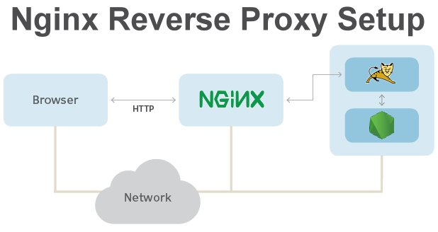

# Reverse Proxy

A reverse proxy is an application that sits in front of webservers and forwards client requests to those web servers. Helps to increase security, performance, and reliability.

1. Rewrite URLs to enhance the presentation and usability of web applications.
2. Security: Hide the identity and details of backend servers, providing an additional layer of security by protecting against direct exposure to the internet.
3. Load Balancing: Distribute incoming network traffic across multiple servers to ensure high availability and even distribution of workloads.

Nginx inspects each HTTP request and identifies which backend system, be it an Apache, Tomcat, Express or NodeJS server, should handle the request

The reverse proxy then forwards the request to that server, allows the request to be processed, obtainsa  response from that backend server, and then sends the response back to the client.

### What is regular Proxy server?
