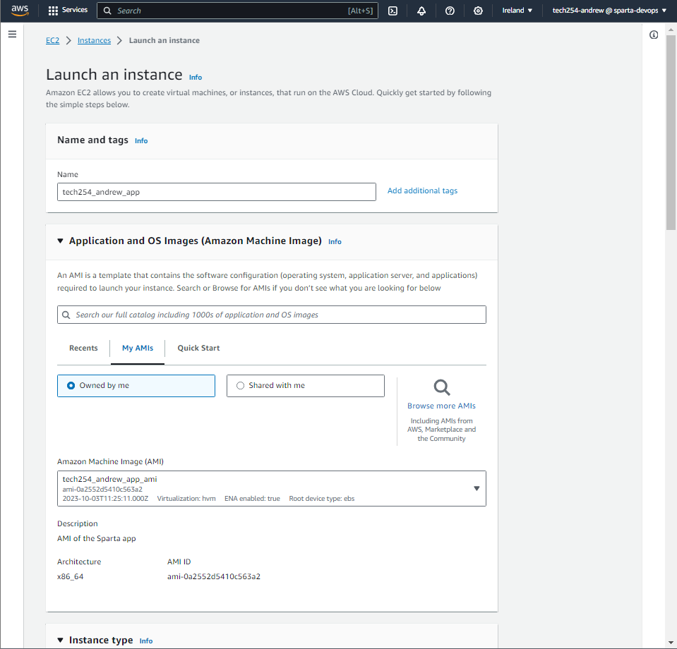
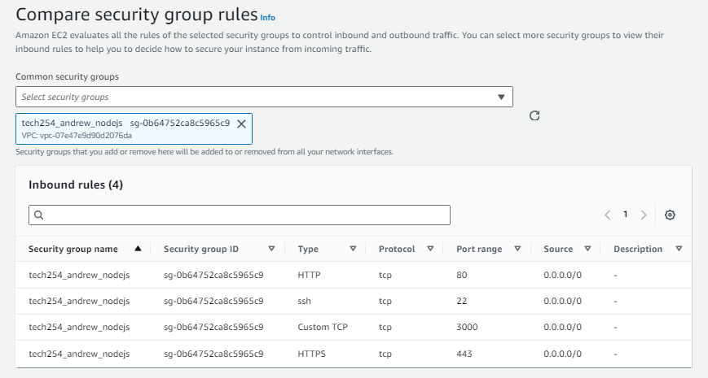
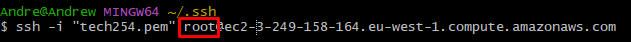
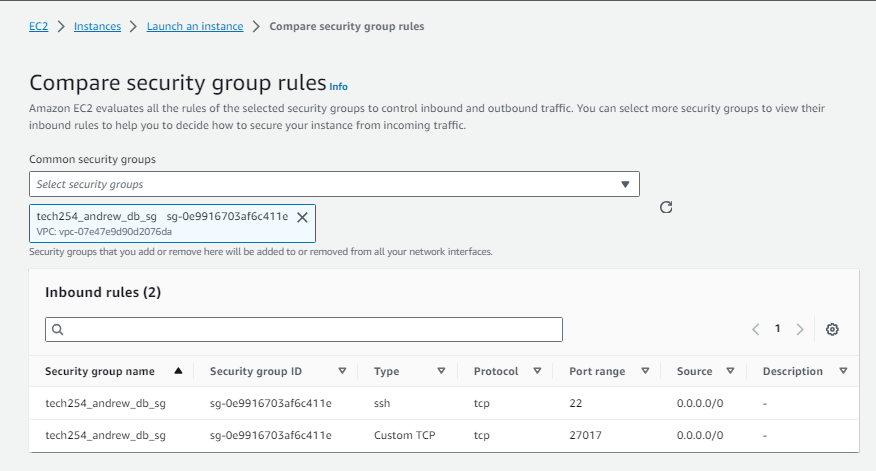
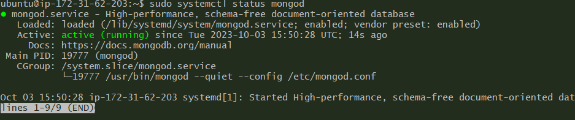
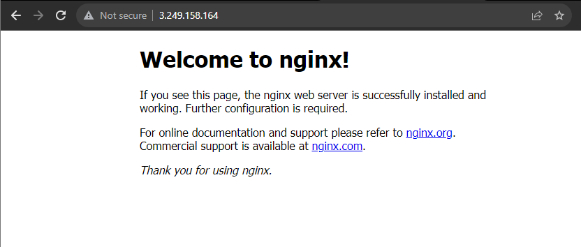
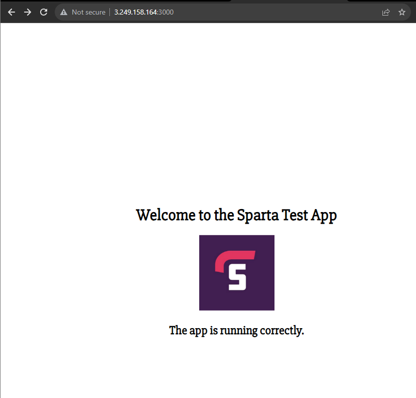
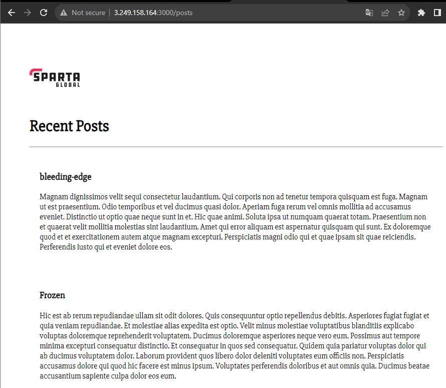

# Setting up a MongoDB server using AMI

1. Set up your instance.
   1. Make sure to use an appropriate naming convention.
   2. Use your pre-created AMI which, hopefully, has your application ready implemented.

2. Make sure your security groups have at least the following:
   

3. Connect to your instance:
   1. Make sure you change root to ubuntu before connecting

4. Set up your database instance.
   1. Standard naming convention
   2. Usual AMI
   3. Usual key pair login

5. Make sure it has the following security group rules:

6. Connect to your database instance.

7. Run the following:
   1. `sudo apt update`
   2. `sudo apt upgrade -y`
   3. `wget -qO - https://www.mongodb.org/static/pgp/server-3.2.asc | sudo apt-key add -`
      1. Should recieve a message "OK"
   4. `echo "deb http://repo.mongodb.org/apt/ubuntu xenial/mongodb-org/3.2 multiverse" | sudo tee /etc/apt/sources.list.d/mongodb-org-3.2.list`
      1. Should recieve a message "deb http://repo.mongodb.org/apt/ubuntu xenial/mongodb-org/3.2 multiverse"
   5. `sudo apt update`
   6. `sudo apt-get install -y mongodb-org=3.2.20 mongodb-org-server=3.2.20 mongodb-org-shell=3.2.20 mongodb-org-mongos=3.2.20 mongodb-org-tools=3.2.20`
   7. `sudo nano /etc/mongod.conf`
      1. change the ip to 0.0.0.0
   8. `sudo systemctl start mongod`
   9. `sudo systemctl enable mongod`
   10. `sudo systemctl status mongod`

8. This was the final step for the database instance. You should now see the database running.

9. `sudo nano /etc/nginx/sites-available/default`
   1.  change all code inside location:
       1.  `proxy_pass http://localhost:3000;`
       2.  `proxy_set_header Host $host;`
       3.  `proxy_set_header X-Real-IP $remote_addr;`

10. Restart nginx:
    1.  `sudo systemctl restart nginx`

11. Add the database instances public as an environment variable:
   1.  `export DB_HOST=mongodb://<your_id_here>:27017/posts`

12. Navigate to the app directory in your pre-set AMI where the application is.
    1.  `npm install`
    2.  `pm2 start app.js` 
    3.  OR
    4.  `node app.js`

13. This should run your program. You can now check the following pages:

