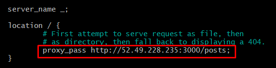

# Reverse Proxy with NGINX Guide

1. Set up app instance and database instance.

2. Here you will see the file named default.
3. Edit the file within nano:
   1. `sudo nano default`

4. Within default, locate the location section.
5. Here, change the code as following:
   1. `proxy_pass http://<your_database_ip_here:3000/posts;`

6. Use `ctrl o`, and then `enter` to save the file
7. Use `ctrl x` to leave the file.

8. Now we will restart nginx as we have saved and changed files:
   1. `sudo systemctl restart nginx`

