# Monitoring and Alerting

### How to set up automated alerts for your EC2 instances CPU Utilization.

1. Navigate to the Cloudwatch page:

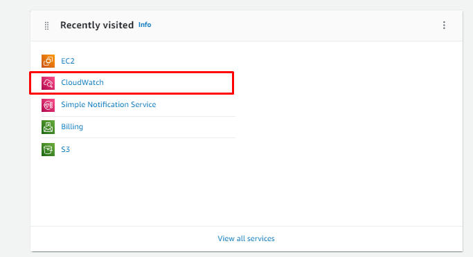

2. In the Alarms section, navigate to the All Alarms section:

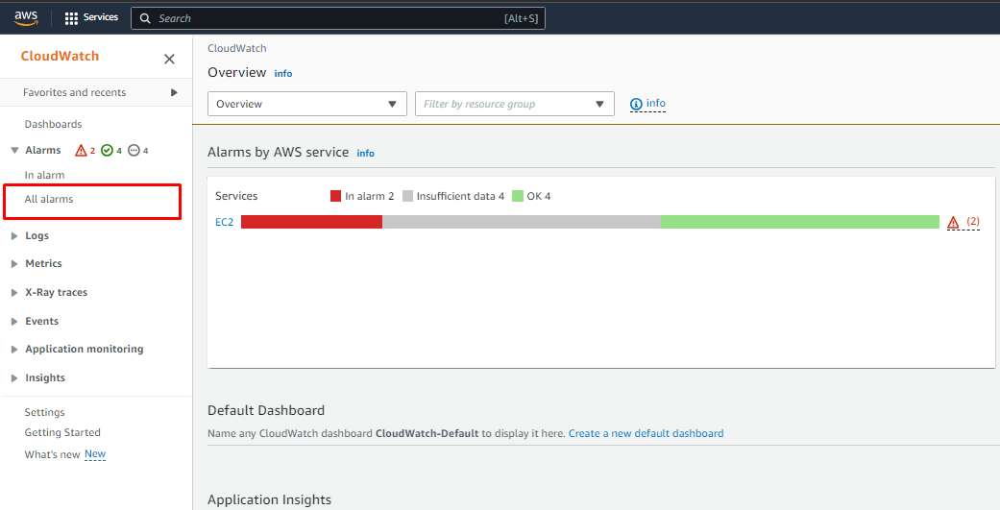

3. Click the Create Alarm button:

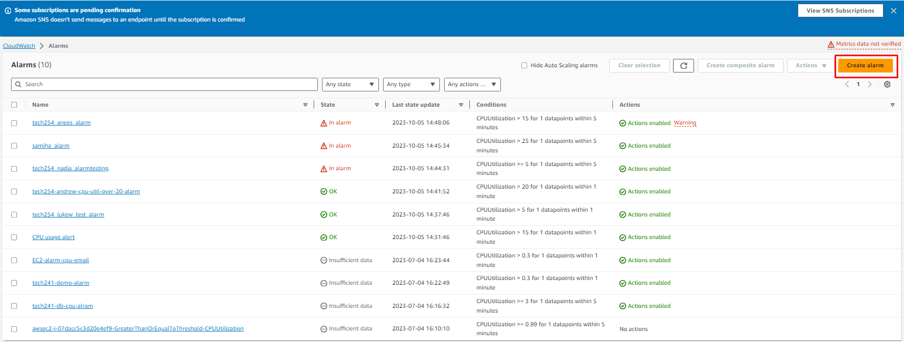

4. Select Metric:

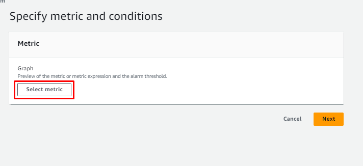

5. Copy your instances ID:

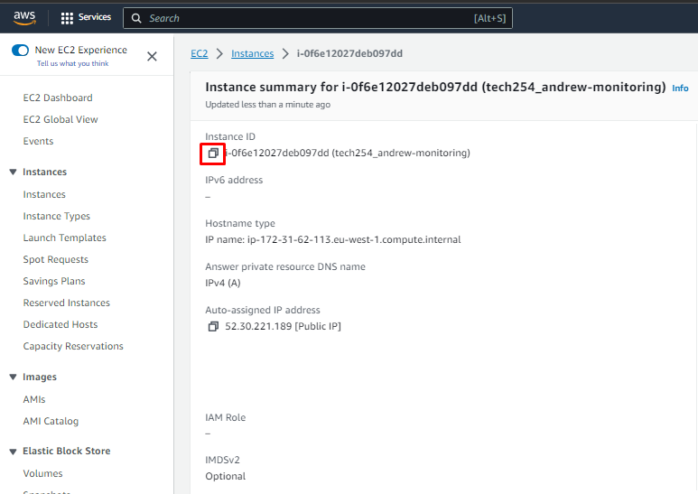

6. While in the Select Metric page, paste your copied ID into the search bar, in the Browse Tab:

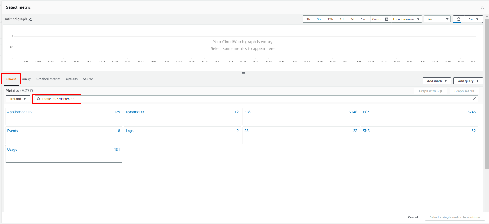

7. Select the EC2 area:

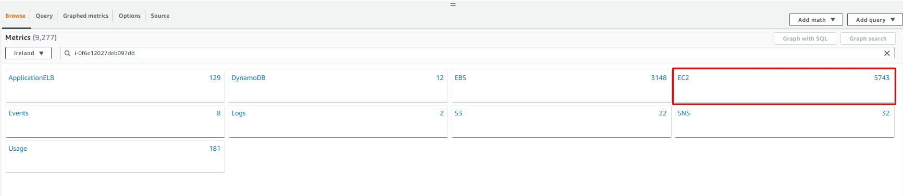

8. Per-Instance Metrics:

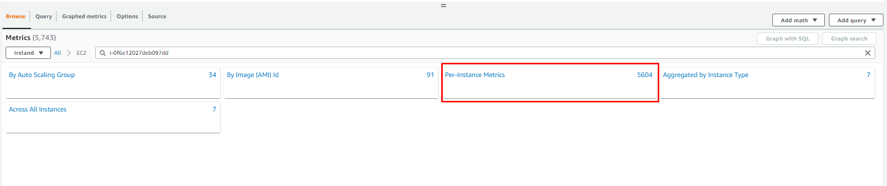

9. This should lead you to a page that contains monitoring techniques specific to your EC2. Select the CPU Utilization Id:

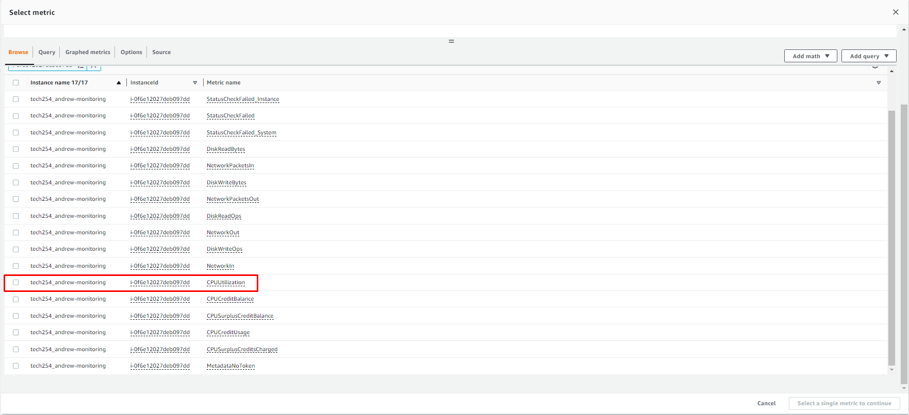

10. Press Select Metric.
11. Specific the conditions:
    1.  Do not change the name.
    2.  Give it an appropriate Period (i.e., 1 minute)
    3.  Choose your % in the `than` box in the conditions section.

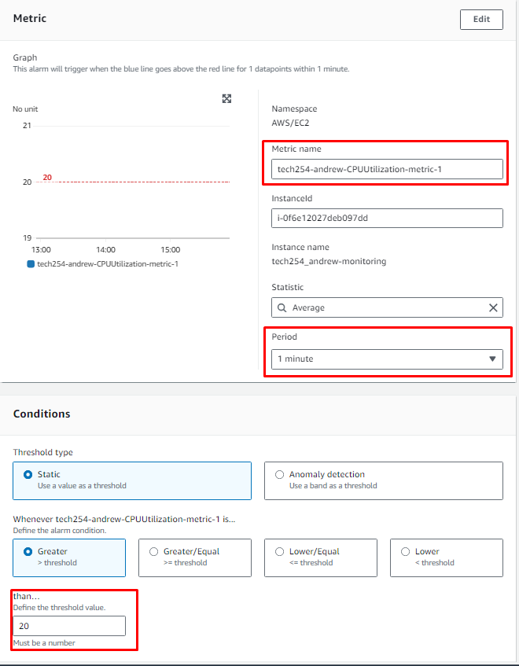

12. Specify where the alarm email will be sent to.
    1.  May have to be configured.

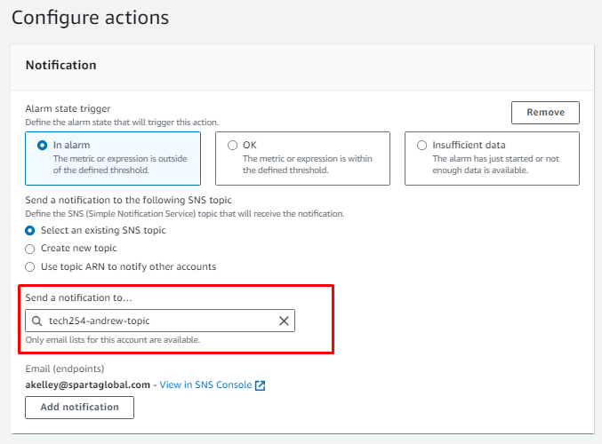

13. Give it an appropriate name:

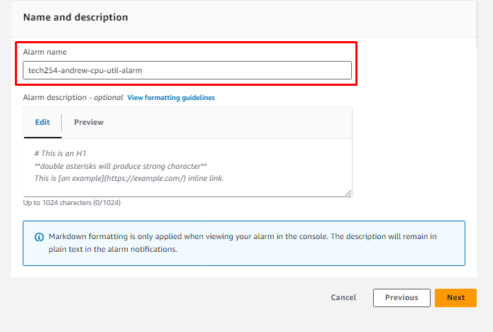

14. If all metrics and configurations look correct, create the alarm.

15. The alarm will start with insufficent data, but will begin to fill in over time.

16. Push your CPU utilization to check if the alarm works.
    1.  This means give your instance multiple commands to push the cpu workload.

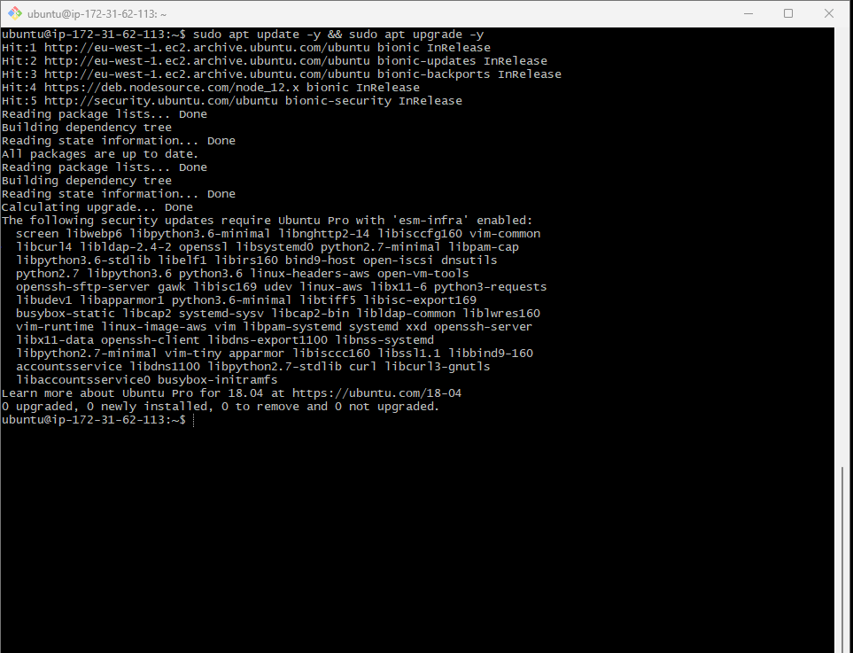

17. Do this multiple times in quick succession to push up the workload.

18. Watch as the CPU utilization begins to rise. This may take a minute.

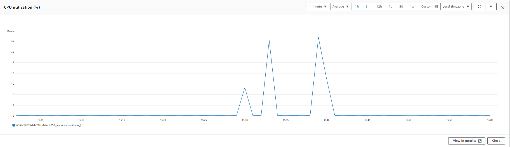

19. As the CPU utilization breaches 20%, the alarm is triggered:

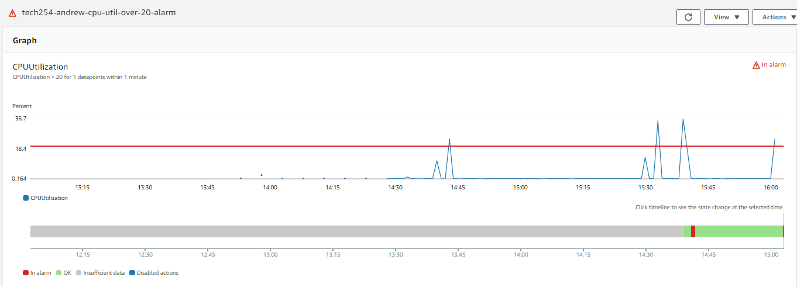

20. You will have received an email:

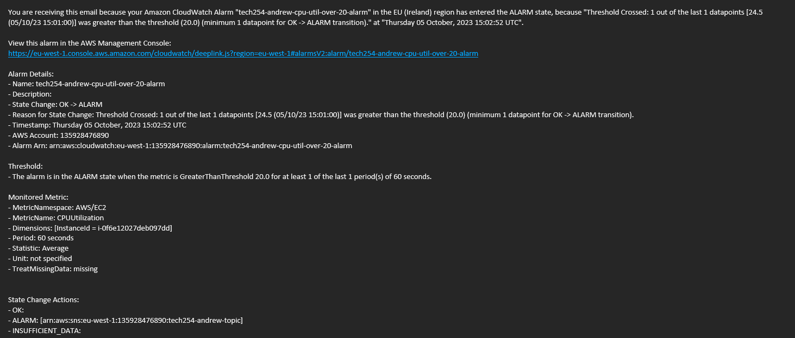