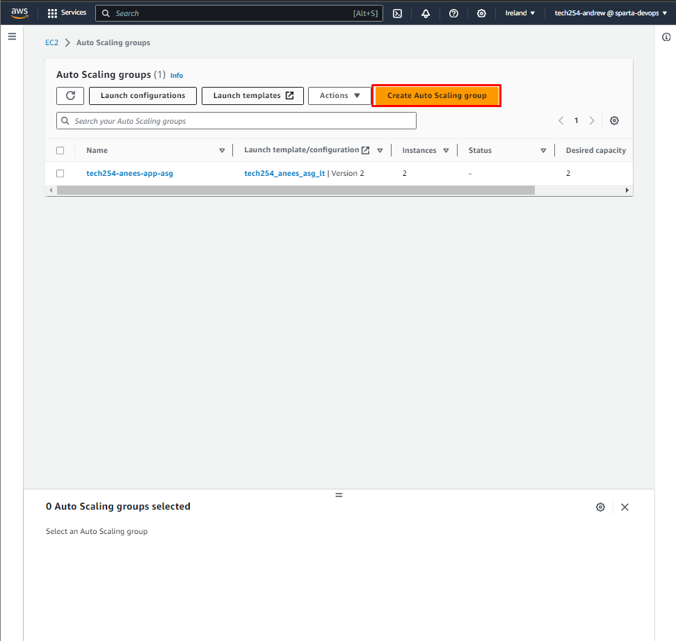
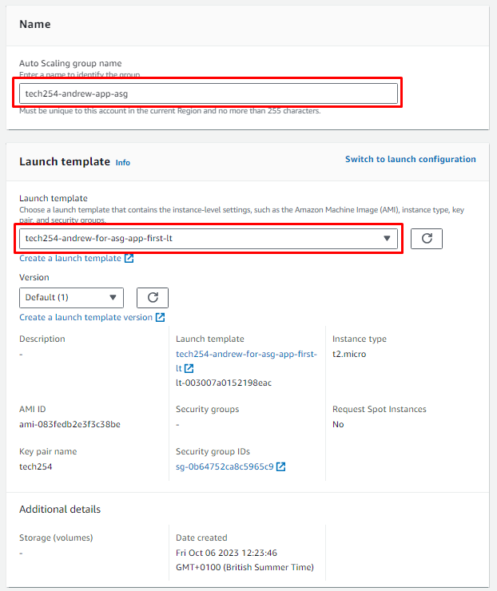
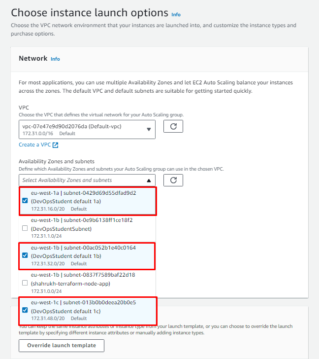
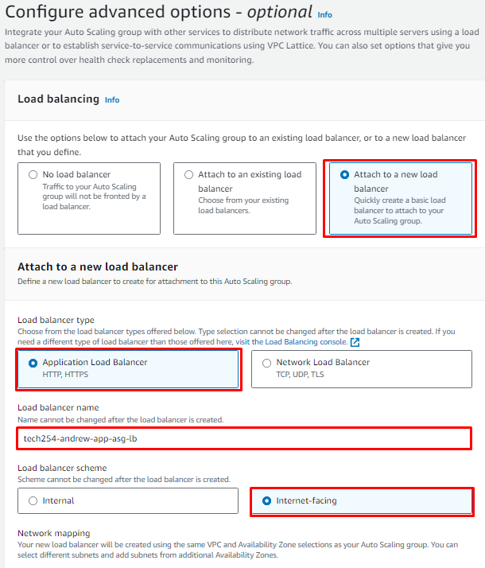
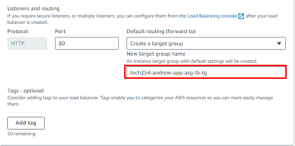
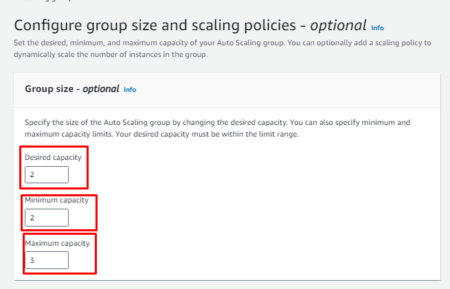
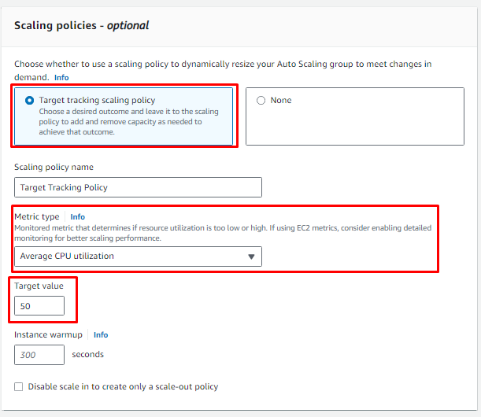
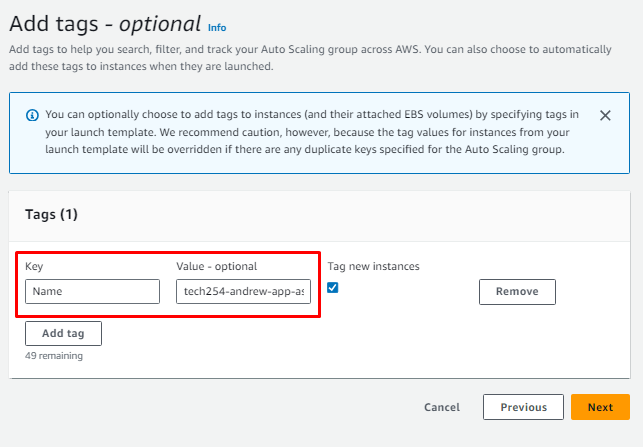

# Auto Scaling Guide

1. Navigate to the Auto Scaling page.
2. Select the Create Auto Scaling group button.

3. Give your ASG an appropriate name.
4. Select your template.
   1. This should have been done in a previous step.

5. Adjust the availability zones as required.
   1. In this instance, we are using default 1a, 1b, and 1c.

6. Configre advanced options.
   1. Attach a new load balancer.
   2. Select Application Load Balancer
   3. Select Internet-Facing
   4. Create a target group, use following naming convention.

7. Configure group size.
   1. For this particular example, the desired and minimum capacity are 2, and maximum capacity is 3.

8. Scaling policies.
   1. Set it to Target tracking scaling policy
   2. Leave the Average CPU utilization

9. Leave notifications.

10. Add tags.
    1.  Change key to "Name"
    2.  Value to "tech254-andrew-app-asg-HA-SC"

11. Launch instances.

12. To access DNS (to see the application) navigate to Load Balancers, select your ID, and select the DNS.