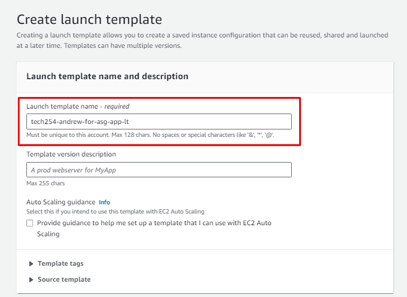
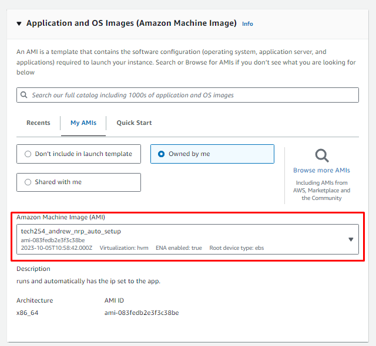
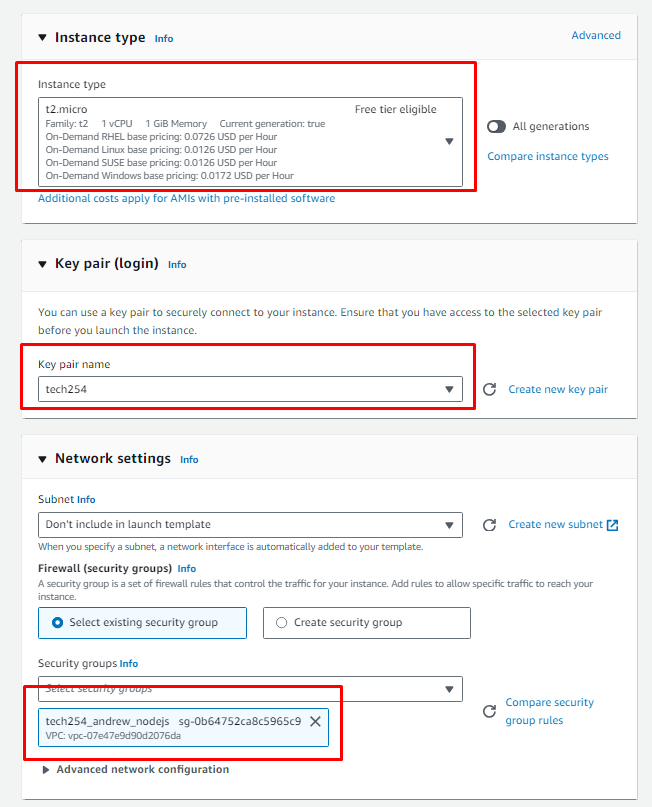
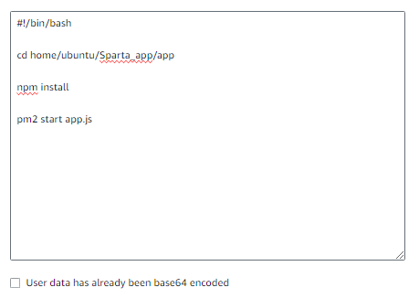

# Launch Template

1. a
2. sd
3. Name
   1. Give it appropriate, descriptive name.

4. Use an AMI that is already provisioned.

5. Standard selections:

6. Advanced Details:
   1. Use the user_data script to cd into the app, npm install, and start the app:

7. 