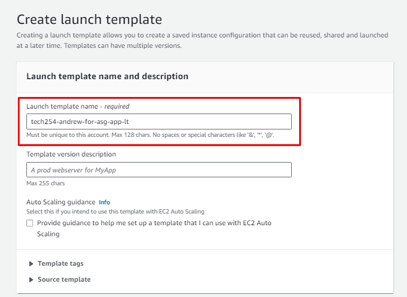
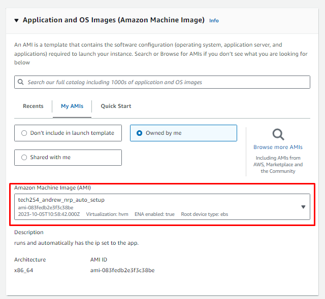
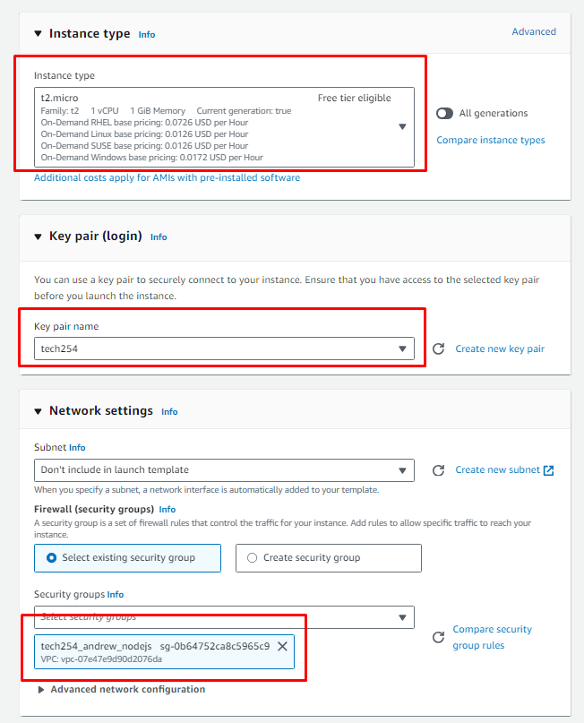
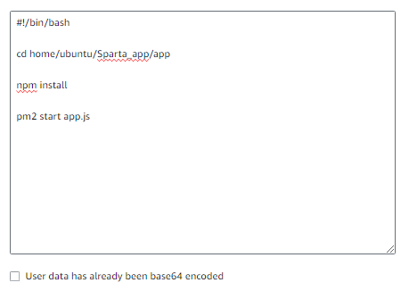
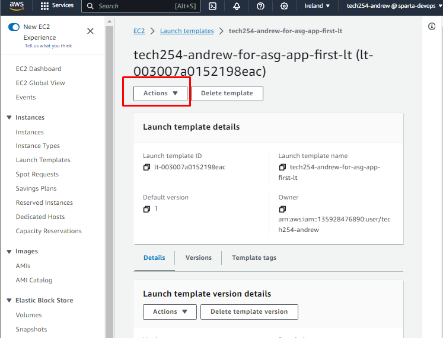
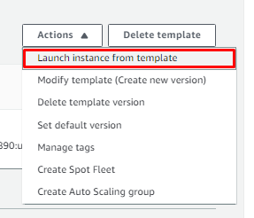
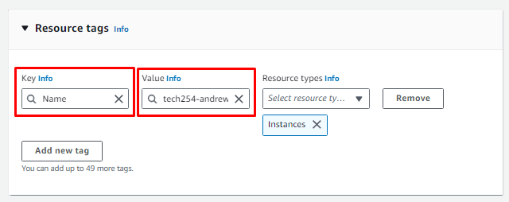

# Create Launch Template

1. Give it appropriate, descriptive name.

4. Use an AMI that is already provisioned.

5. Standard selections:

 

6. Advanced Details:
   1. Use the user_data script to cd into the app, npm install, and start the app:

7. Create.

# Begin Launch Template

1. Find the actions tab while on your Launch Template.

2. Select the "Launch instance from template" button.

3. As this is a template, it is already set up. The only changes now are to set the resource tags:
   1. Select Name.
   2. Give the value an appropriate name.

4. Launch instance.

