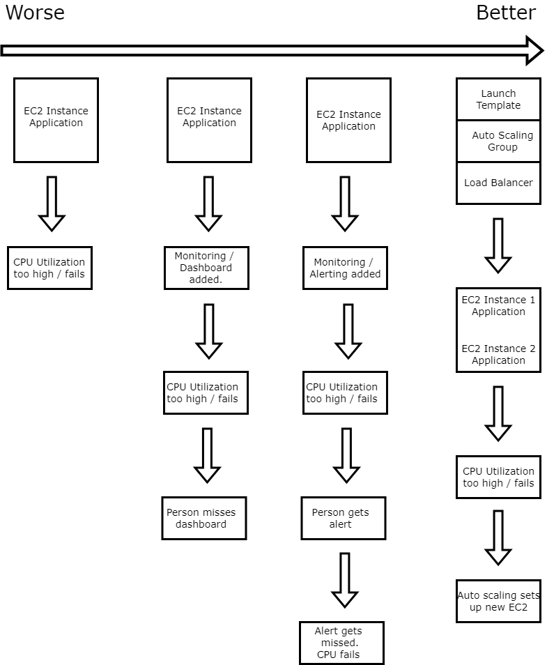

# The progression of monitoring, alerting, and disaster prevention.

## No Protection

1. Set up EC2's to host web application
2. CPU utilization exceeds ability.
3. CPU continues to use over capacity, and stops working.

## Monitoring

1. Set up EC2's to host web application.
2. Set up monitoring of EC2 to check CPU utilization.
3. CPU utilization exceeds ability.
4. Dashboard updates, a person must spot this error.

This implementation of monitoring is better than no monitoring at all, but leaves you open to human error / availability. The CPU utilization has to be monitored by a person, who could, for any reason, miss the CPU reaching high levels of utilization.

## Alerting

1. Set up EC2's to host web application.
2. Set up monitoring of EC2 to check CPU utilization.
3. CPU utilization exceeds ability.
4. Automated alert sent to engineers that CPU utilization is above acceptable levels.
5. Alert allows engineers to then set up a new instance to help lighten the load.

This implementation of monitoring and alerting is better, as is lowers the chance of human error, and missing what is happening on the dashboard. However, this step is still flawed as human reaction time is still unreliable, and an engineer would still have to manually go through the steps to spin up another machine.

## Autoscaling

1. Set up Launch Template, Auto Scaling group, and Load Balancer.
2. EC2's automatically set up to host web application.
3. Set up monitoring of EC2 to check CPU utilization.
4. CPU utilization exceeds ability.
5. Auto Scaling Group automatically spins up another preset EC2 ready to sync with the server handling.
6. Load balancer directs traffic equally to reduce load on average.

This implementation is much greater than the previous versions. Here, the chance of human error is lowered considerably (unless there is error in the set up of AMI, launch templace, or Auto Scaling Group) as there is no intervention or required reaction time.

