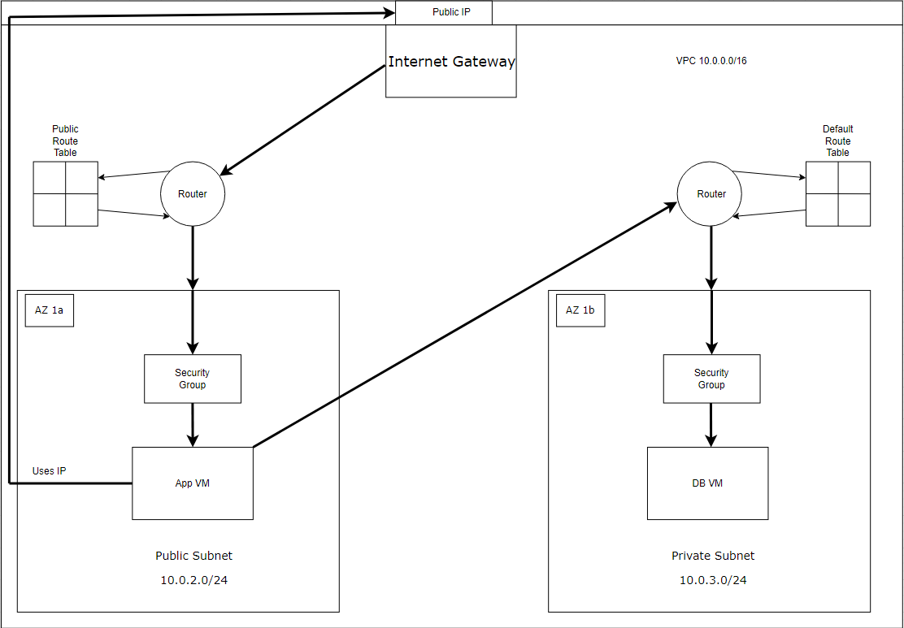

# VPC - Virtual Private Cloud

## What is a VPC? 

A VPC is a piece of 2 tier architecture: a virtual network environment that allows you to customize network infrastructure and security. They use an Internet Gateway, acting as a doorway, subnets, as well as routers, to direct traffic to and from the specified VM's to keep the network secure.

## Made of the following:

1. CIDR Block: 
   1. defines the IP address range for your VPC. It specifies the range of IP addresses that can be used within the VPC.
2. Subnets:
   1. Subdivisons of the VPC, associated with a specific availabiltiy zone. Can help you logically organize your resources and controll access to them.
   2. Public subnets that have direct internet access.
   3. Private subnets without direct access to the internet.
3. Route Tables:
   1. Each subnet is assocaited with a route table.
   2. Defines the destination for the traffic.
   3. Example: Sending traffic to an internet gateway for public subnets.
4. Internet Gateway:
   1. The doorway into all elements.
   2. Allows public subnets to connect to the internet and recieve traffic.
   3. It's the doorman between the resources in your VPC and the public internet.
5. Security Groups:
   1. Firewall set by the user.
   2. Controls inbound and outbound traffic.
   3. Rules that allow or deny traffic based on source, destination IP, and ports.

- AWS is like a building that is shared between everyone that uses the public cloud.
- Everyone uses a default public, shared VPC.
- There is a default subnet for each availability zone.
- Custom VPC is like having your own flat in this building. Only you have access to it.
- Control on how people access your applications through the outside.
  - Create your own subnets in each availability zone.
- On Azure, there is no such thing as default VPC. VPC's are virtual network.

1. Internet Gateway - Doorway into VPC
   1. VPC 10.0.0.0/16 <- CIDR
   2. Uses router to direct traffic to the public subnet.
   3. Public Subnet
      1. App VM
      2. Security Group
   4. Invisible router directs database requests to database vm.
   5. Private Subnet
      1. Database VM
      2. Security Group