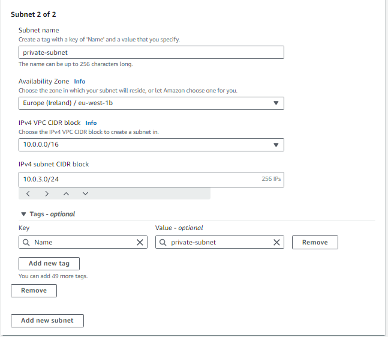

# VPC


### Step 1

Navigate to the VPC console, and select create VPC.

1. VPC Only
2. IPv4 CIDR manual input
3. No IPv6 CIDR block


# Subnet 

### Step 1

Now to create the public and private subnet. Once the VPC has been made, navigate to the Subnet page on the left.

1. Select your VPC.
2. Create one public subnet
   1. Availability zone: eu-west-1a
   2. IPv4 subnet CIDR block: 10.0.2.0/24
3. Create one private subnet
   1. Availability zone: eu-west-1b
   2. IPv4 subnet CIDR block: 10.0.3.0/24
4. Create Subnet





# Internet Gateway:

### Step 1

Navigate to the Internet Gateway page. 

1. Create IG
   1. Name = tech254-andrew-2tier-vpc-ig


2. Attach it to a VPC. The button is located in the top right.


3. Search for your VPC (by name)


# Route Table:

Navigate to the Route table page.

1. Name: public-rt
2. Select your VPC by name.
3. Create route table.


# Associations

1. Subnet Associations
2. Edit subnet associations


3. Select Public Subnet.
4. Save associations.
5. Reselect Routes.


6. Leave local target / destination as is.
7. Select Add route.
8. Destination: 0.0.0.0/0
9. Target: select drop down, and select internet gateway, and then the followup VPC.


10. Check if your assocations have worked:


# Set up App and DB VM's using newly created Subnets

1. Begin AMI set up process as usual.

### Network Settings:

- Database VM

1. Select your newly created VPC.
2. Assign your private VPC (This is the database which should never be seen / interacted via regular internet access)
3. Create security group:
   1. ssh: port 22
   2. mongodb: port 27017


- App VM

1. Select your newly created VPC.
2. Assign your public VPC
3. Enable AUto-assign public IP
4. Create security group:
   1. ssh: port 22
   2. HTTP: port 80
   3. 3000: port 3000
5. User Details:
   1. export DB_HOST to include private IP of database VM.
   2. npm install
   3. node seeds/seed.js
   4. pm2 kill
   5. pm2 start app.js


```
#!/bin/bash

export DB_HOST=mongodb://10.0.3.179:27017/posts

cd /home/ubuntu/Sparta_app/app
npm install

node seeds/seed.js

pm2 kill
pm2 start app.js
```

