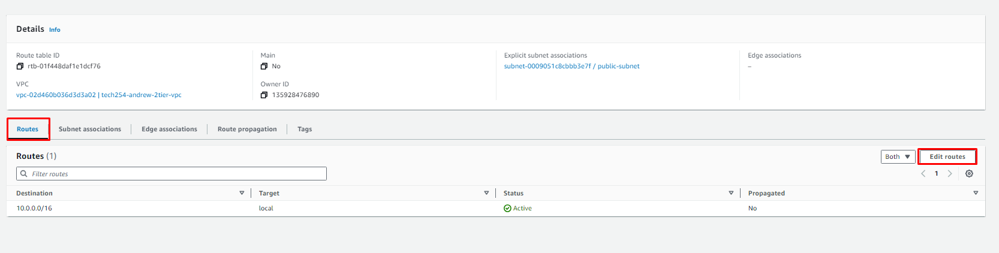

# VPC

1. VPC Only
2. IPv4 CIDR manual input
3. No IPv6 CIDR block

# Subnet

1. Select your VPC.
2. create one public subnet
   1. IPv4 subnet CIDR block: 10.0.2.0/24
3. create one private subnet
   1. IPv4 subnet CIDR block: 10.0.3.0/24
4. Create Subnet

# Internet Gateway:

1. Create IG
   1. Name = tech254-andrew-2tier-vpc-ig
2. 

# Route Table:

1. 

