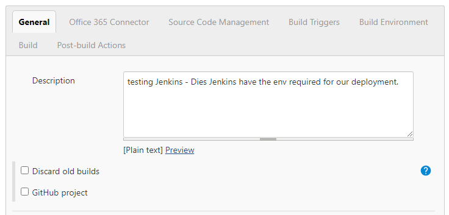
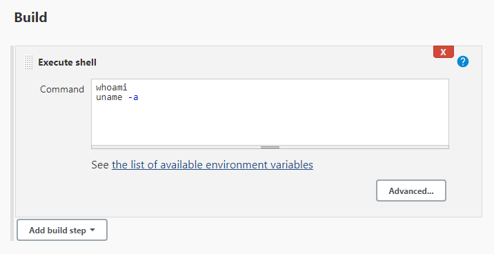

# Jenkins

1. Navigate to the Jenkins homepage.
2. Select `New Item`
3. Give your project a name.
4. Select what type of project you want (in this case, a Freestyle Project)

5. Give it a description.
   1. While optional, this is highly advised.

6. Select `Discard old builds`
7. Set the `Max # of builds to keep` to `3`

8. Select what step you wish it to complete.
   1. Here, we are selecting Execute Shell
   2. Jenkins will create a bash file (.sh gile)
9. To test if this build works, type the following in the command window:
   1.  `whoami`
   2.  `uname -a`

10. Press Save.
11. Return to the Dashboard.

12. Using the dropdown menu on your job, select the build now button.

13. Select the Console Output to see if it has worked.

### Possible Issues

If the server endpoint IP address is to change, then you need to change the GitHub webhook to update it.
It will no longer automatically update if it is using the wrong IP address.