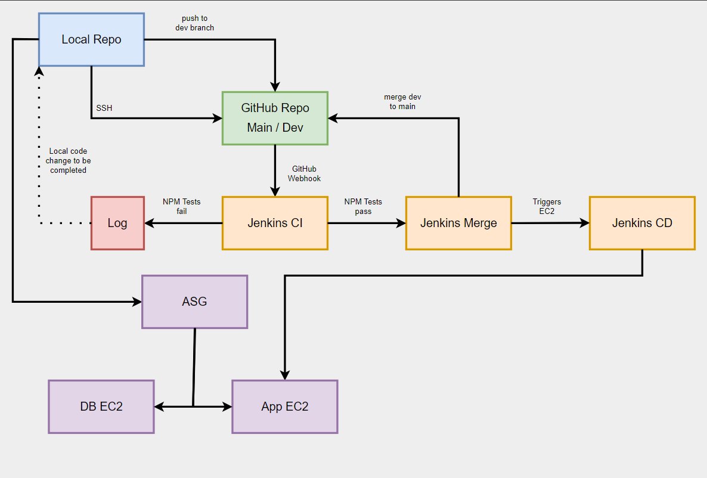

# CICD Workflow

1. Local repository connected to GitHub via SSH.
2. Local repo commits & pushes to GitHub repo.
3. WebHook trigger on GitHub communicates with Jenkins that a push has been made to GtiHub.
4. Jenkins clones the repo using SSH.
5. The new code is tested on agent node.
6. If it fails, error log is generated.
7. If it passes:
   1. Master Node merges code to main branch.
   2. Code is pulled onto EC2 machine and restarted.

