# How to set up automated merging using Git Publisher in Jenkins to merge branches to master in GitHub

## Job1

### CI Job creation

1. Set up a CI job as done previously:

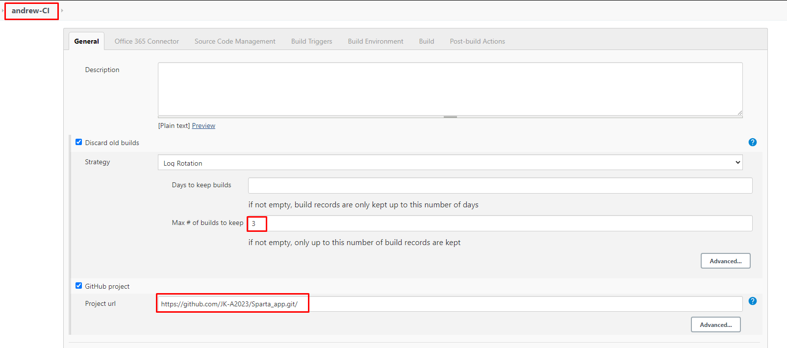
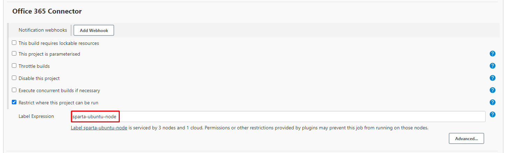

### Source Code Management:

1. Use SSH url.
2. Branch specifier set yo `*/branch_here`. Make sure to NOT use main.
   1. We are trying to read from the secondary branch to merge into main.

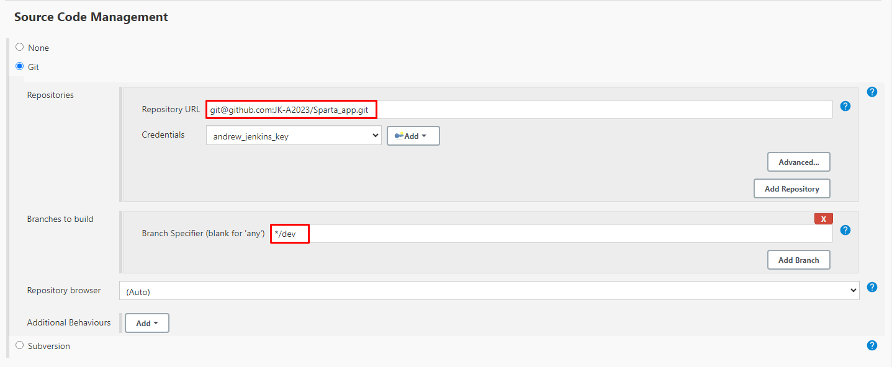

### Build Triggers:

1. Select GitHub hook.

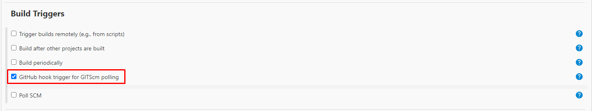

### Build Environment:

1. Provide Node

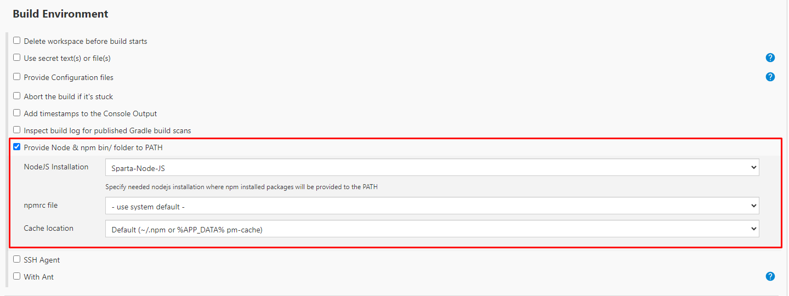

### Build:

1. Execute Shel:
   1. `cd app`
   2. `npm install`
   3. `npm test`

### Post-build Actions:

1. We now want to specify the next job to trigger if the git push is stable.

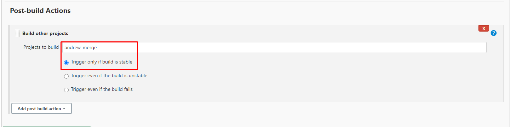

2. Save this job.
3. If you haven't set up the name of your next job, there may be an error here.
4. Simply set up the next job, and the error will dissapear.

## Job2

### Job Setup:

1. Set up standard job settings:

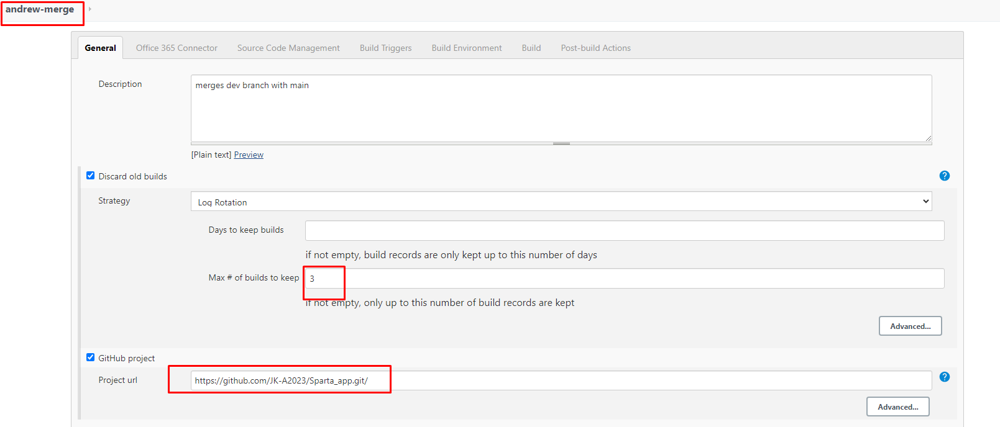

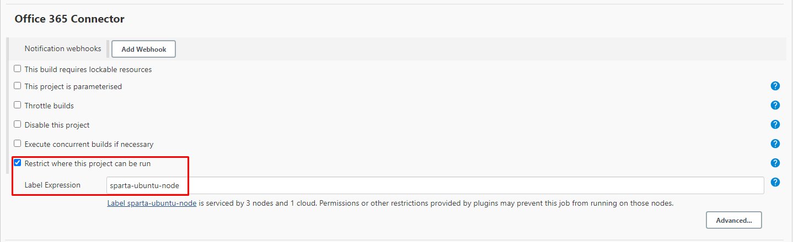

### Source Code Management:

1. Remeber to use SSH url for repository.
2. Branch Specifier: `*/dev`
3. Additional Behaviours:
   1. Merge before build:
   2. Name of the repository will be the origin.
   3. The branch we are merging to is main.

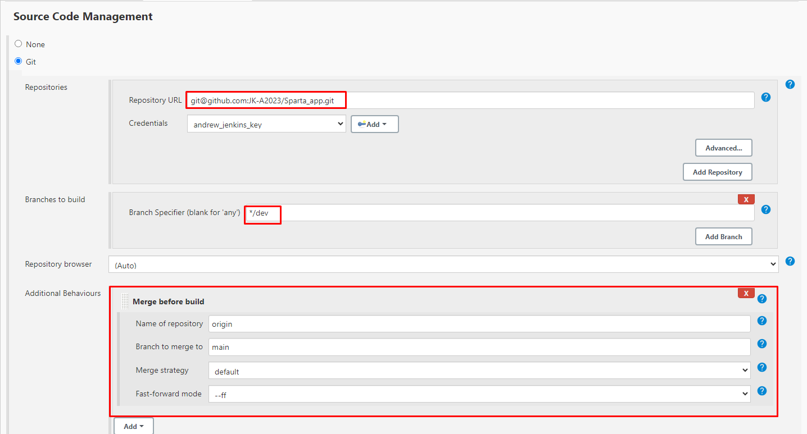

4. No Build Triggers.

### Build Environment:

1. SSH Agent:
   1. Use AWS .pem file.

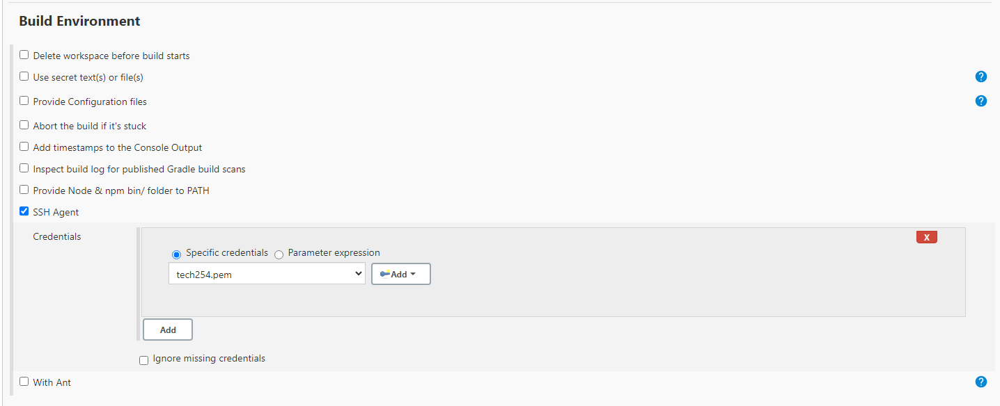

2. No Build steps.

### Post-build Actions:

1. Merge Results.
2. Add Branch
   1. Branch to push: `main`
   2. Target remote name: `origin` (or whatever you've called the remote)

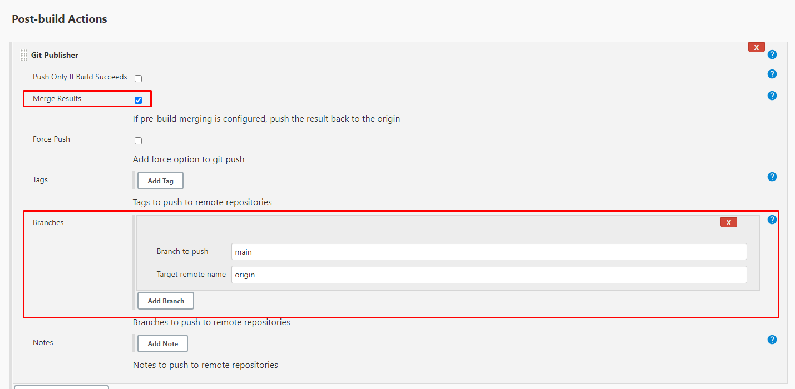