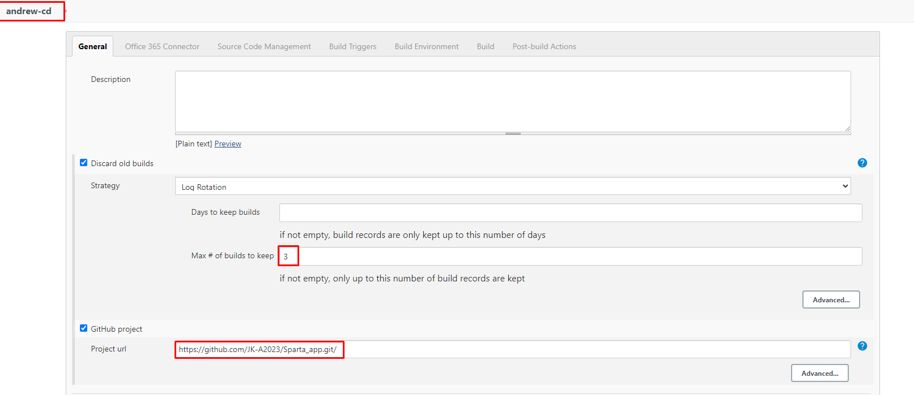
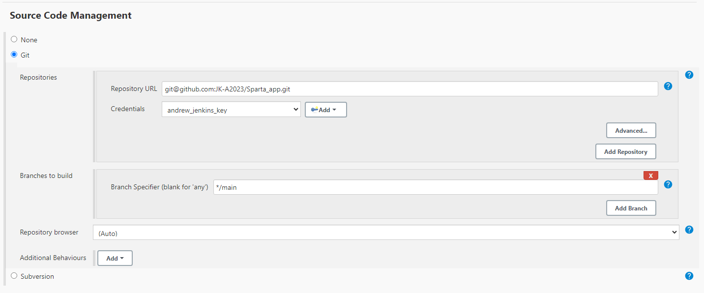
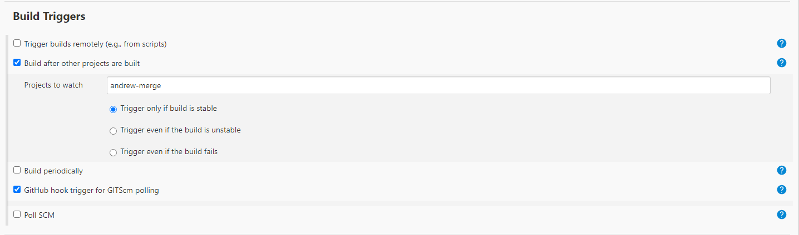
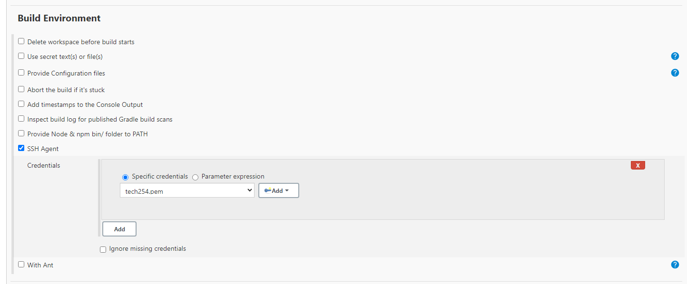
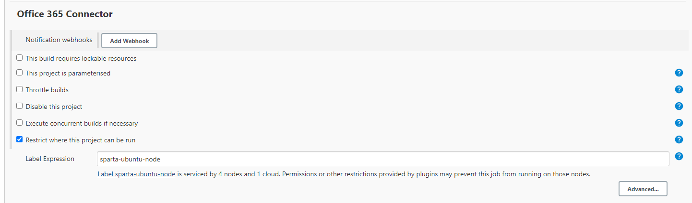
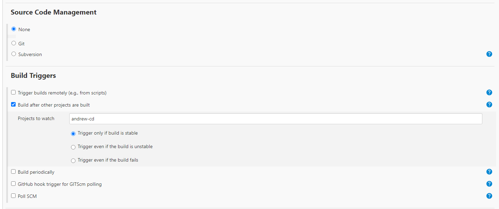
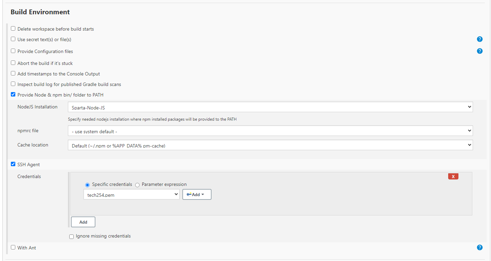

# Setting up CD


1. The user sets up a local repo.
2. User connects this via SSH to GitHub.
3. User checkouts out Dev branch on local repo, seperate from main.
   1. Main branch will now not be actively worked on.
   2. Only Dev branch will be worked on.
   3. Main exists for production ready code only.
   4. Dev branch, when tested, will be merged with Main.
4. User sets up Jenkins CI job:
   1. Uses GitHub webhook using SSH to check for when pushes are made to Dev branch.
   2. Copies code onto EC2 instance.
   3. Runs `npm test` on copied code.
   4. If it fails, a log is generated. User must use this log to find out where failure was, and rectify.
   5. If it passes, Jenkins points to next Jenkins job (Post-Build).
5. User sets up Jenkins Merge job:
   1. Runs Post-Build from previous job, only if it works.
   2. Merges Dev branch to Main using Git Publisher.
   3. Triggers next Jenkins CD job.
6. User sets up app EC2:
   1. Launch EC2 instance.
   2. Standard set up.
   3. Security groups on ports 3000, 22, and 80.
7. User sets up Jenkins CD job:
   1. Execute Shell command to sync Jenkins EC2 with user EC2 ip.
   2. SSH using "StrictHostKeyChecking=no" to bypass authentification check.
   3. Run relevant commands to set up and run nginx.
   4. BUILD MANUALLY FOR FIRST TEST.
8. Check EC2 public ip, verify nginx running.

## App EC2:

### Launch EC2 instance.

1. Using `ami-0136ddddd07f0584f` for AMI.
2. Security Groups:
   1. Port 3000 - Node app listens on 3000
   2. 22 - ssh
   3. 80 - HTTP

## Jenkins-CD

Set up third job:

### General

1. Max builds: 3
2. GitHub Project: `https://github.com/JK-A2023/Sparta_app.git`



### Office 365 Connector:

1. Restrict where project can be run: `sparta-ubuntu-node`


### Source Code Management:

1. Enable Git.
2. Repository URL: `git@github.com:JK-A2023/Sparta_app.git` 
3. Credentials: `andrew_jenkins_key`
4. Branch to build: `*/main`



### Build Triggers:

1. Build after other projects: `andrew-merge`
2. GitHub hook trigger: `enable`



### Build Environment:

1. SSH Agent: `tech254.pem`



### Build:

1. Set up execute shell:

```
rsync -avz -e "ssh -o StrictHostKeyChecking=no" app ubuntu@<ec2_public_ip_here>:/home/ubuntu/

ssh -o "StrictHostKeyChecking=no" ubuntu@<ec2_public_ip_here> <<EOF
	sudo apt-get update -y
    sudo apt-get upgrade -y
    sudo apt-get install nginx -y
    sudo systemctl restart nginx 
    sudo systemctl enable nginx
    
EOF
```

### Test:

Before using sequence, always build independently first, to see if it works.

## Jenkins-App

Set up fourth job:

### General:

1. Add (and change in all oder jobs) 4 builds to keep:


### Office 365 Connector:



### Source Code Management & Build Triggers:



### Build Environment:

1. Provide Node
2. SSH Agent



### Build:

1. Execute Shell:

```

ssh -A -o "StrictHostKeyChecking=no" ubuntu@34.249.110.64 <<EOF

    #install correct Nodejs version
    curl -sL https://deb.nodesource.com/setup_12.x | sudo -E bash -
    
    #install NodeJs, pm2
    sudo apt install nodejs -y
    sudo npm install pm2 -g
    
    cd app
    
    #Install dependencies
    npm install -y
    
    pm2 kill
    
    #Run file
    pm2 start app.js
```